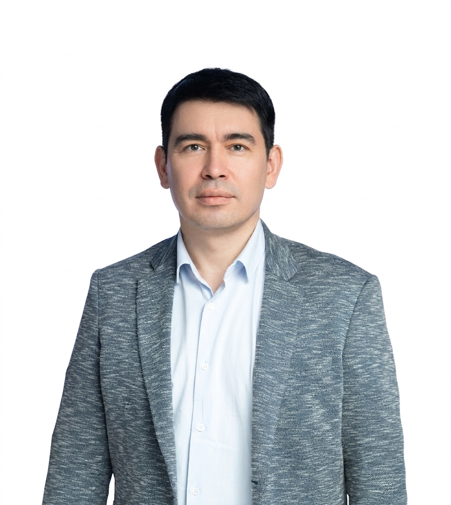

::: {.qv-hero}
::: {.qv-hero-grid}
{.qv-portrait fig-alt="Марсель Салихов"}

::: {.qv-hero-copy}
## Марсель Салихов

Экономика, данные, финансы и аналитические системы.

::: {.qv-hero-meta}
[Институт энергетики и финансов](https://fief.ru/about/our-team/our-team_experts/salikhov-marsel-robertovich/) · [Высшая школа экономики](https://www.hse.ru/org/persons/26780297/)

Пишу учебник по курсу "Количественные финансы". 
:::
:::
:::
:::

## Разделы

::: {.qv-card-grid}
::: {.qv-card}
### Блог

Короткие аналитические заметки по экономике, рынкам, данным и технологиям.

[Перейти](posts.qmd)
:::

::: {.qv-card}
### Проекты

Дашборды, модели, исследовательские прототипы и BI-инфраструктура.

[Смотреть](projects.qmd)
:::

::: {.qv-card}
### Преподование

Материалы по преподаваемым курсам и семинарам.

[Изучить](courses.qmd)
:::

::: {.qv-card}
### Выступления

Конференции, академические семинары и презентации по экономике, энергетике и финансам.

[Смотреть](talks.qmd)
:::

::: {.qv-card}
### Комментарии в СМИ

Экспертные комментарии и интервью для деловых изданий и медиа.

[Ознакомиться](media.qmd)
:::

::: {.qv-card}
### Технические заметки

Практические заметки по R, Python, BI, DuckDB, Shiny, Docker.

[Открыть](notes.qmd)
:::
:::

## Темы

Макроэкономика
Отраслевые рынки
Энергетика
Финансы
Эконометрика
Superset / DuckDB / Shiny
Python / R / Julia

## Последние публикации

:::{#recent-posts}
:::

[Все публикации →](posts.qmd)
