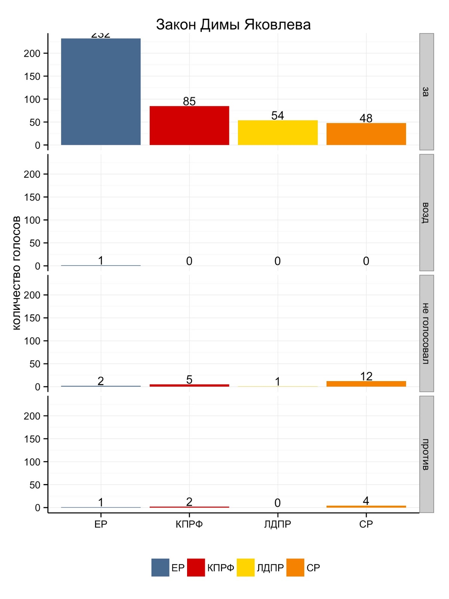
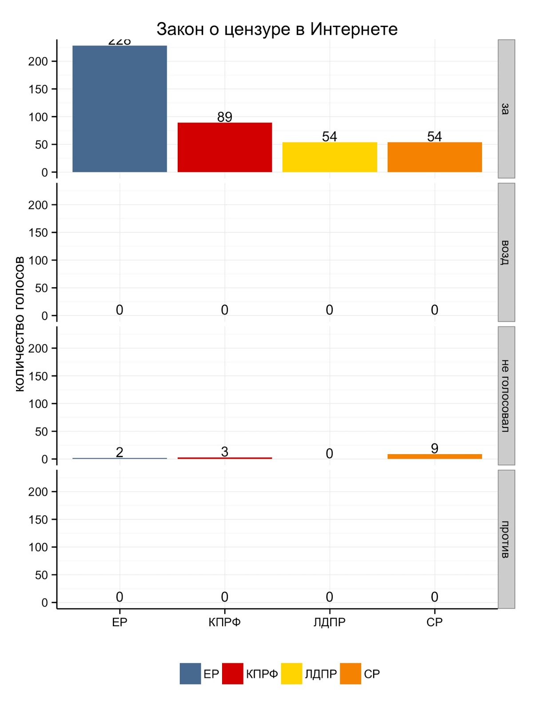
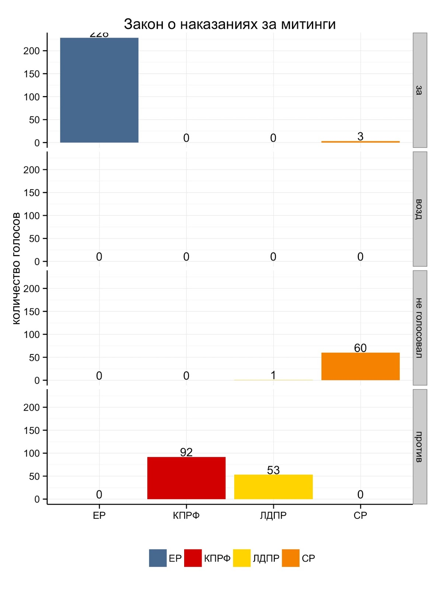
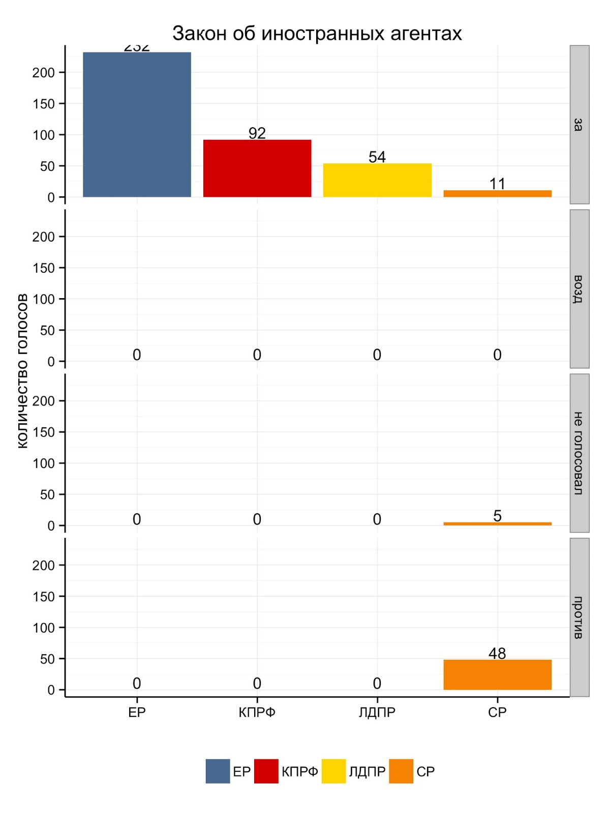

Когда в Государственной Думе принимался печально известный анти-Магнитский "закон Димы Яковлева",  многие обратили внимание на то, как персонально голосовали депутаты за этот закон. Многие СМИ и интернет-ресурсы писали об этом - кто и как проголосовал, поименно. Напомню, что к третьему, то есть финальному чтению этого законопроекта, противников осталась всего 7 человек из 448 имеющихся в наличии депутатов, то есть всего лишь 1,5%. Вот их имена:  
  

  1. Алферов Жорес Иванович (КПРФ)
  2. Гудков Дмитрий Геннадьевич (Справедливая Россия - СР)
  3. Озеров Андрей Александрович (Справедливая Россия - СР)
  4. Петров Сергей Анатольевич (Справедливая Россия - СР)
  5. Пономарев Илья Владимирович  (Справедливая Россия - СР)
  6. Резник Борис Львович (Единая Россия)
  7. Смолин Олег Николаевич (КПРФ). 

Меня, честно говоря, удивила редкая степень единодушия наших народных избранников в отношении явно неадекватного закона, принимаемого с необычайной скоростью. Сразу же был понятен и огромный общественный резонанс. В любом случае, в России явно не 1,5% противников этого закона, а гораздо больше. Тем не менее, депутаты проголосовали именно так.  

  

Поэтому я решил посмотреть на то, как вообще голосуют наши депутаты. Хотя я не слишком слежу за политикой и не смотрю ТВ, но у меня были давно смутные догадки о том, что о чем говорят депутаты и то, что они делают  \- это довольно разные вещи. К примеру, хорошо известно, что ЛДПР хотя и имеет свое номинально независимое мнение и крикливого лидера, по факту практически всегда выступает сторонником партии власти. Но одно дело - подозревать, другое дело - смотреть на ситуацию объективно, на данных. 

  

Это была довольно давняя идея, но по каким-то причинам несколько лет назад я не смог найти информации по этому поводу. Возможно, просто был невнимателен. Когда принимался "закон Димы Яковлева" я решил проверить сайт Госдумы еще раз и был приятно удивлен. Благодаря на удивление квалифицированному ИТ-персоналу аппарата ГД, за любым законотворческим телодвижением довольно легко и удобно смотреть. 

Во первых, есть ["Система анализа результатов голосований на заседаниях Государственной Думы"](http://vote.duma.gov.ru/), на которой собственно можно найти результаты голосований по тому или иному вопросу. Для быстрой проверки результатов голосований - самое то. 

Во вторых, есть "Автоматизированная информационная система [«Законопроект»](http://duma.gov.ru/systems/law/)", в которой можно получать автоматизированным способом (API) множество интересной информации в удобном формате, в первую очередь, списки принятых законопроектов за тот или иной период времени. 

В третьих, есть ["Автоматизированная система законотворческой деятельности"](http://asozd2.duma.gov.ru/), в которой удобно смотреть любые телодвижения и хронологию событий по любому законопроекту, включая дополнительные материалы такие как пояснительные записки к законопроектам. Вы не поверите, но порой там встречаются абсолютные шедевры бюрократической мысли и канцелярского языка и чудеса логики! 

  

Когда я посмотрел на это все, то понял, что эта информация заслуживает того, чтобы ее аккуратно и бережно собрать и проанализировать. Вообще эта тема для отдельного большого исследовательского проекта. В США есть отличный проект [voteview.com](http://voteview.com/), на котором ученые в области политической экономии Кит Пул (Keith T Poole) и Говард Розенталь (Howard Rosenthal) собирают, анализируют и разрабатывают новые методы анализа данные по результатам голосований в Конгрессе и Сенате США. 

С помощью подобного анализа можно ответить на довольно любопытные вопросы. К примеру, насколько вообще поляризирована наша Дума. Это вообще место для дискуссий и различных мнений или мнение может быть только одно? Кто оппозиционных фракций и насколько оппозиционен? Или оппозиционность это только ширма для публики. И так далее. Я буду по мере сил и времени заниматься этим проектом и делиться результатами. За последние несколько дней я успешно решил технические вопросы получения данных с помощью отличного языка для статистического анализа R. Возможно, напишу еще более подробно именно про технические аспекты более подробно для себя и для интересующихся. Впереди - заниматься анализом и интерпретацией полученных результатов. 

  

Вот некоторые первые результаты. Я посмотрел на результаты голосований наиболее запомнившимся законам 2012 года. Во всех случаях для простоты речь идет о голосовании в третьем, окончательном чтении. 

  

####  Закон Димы Яковлева 

Официальное название - О проекте федерального закона № 186614-6 "О мерах воздействия на лиц, причастных к нарушениям основополагающих прав и свобод человека, прав и свобод граждан Российской Федерации"

Результаты голосования по фракциям:

 В принципе, можно смотреть и пофамильные результаты, но результаты по фракциям легче визуализировать и воспринимать. Легко видеть, что все фракции поддержали законопроект, "против" голосовали только единицы-еретики. 

  

####  Закон о цензуре в Интернете

Официальное название - О проекте федерального закона № 89417-6 "О внесении изменений в Федеральный закон "О защите детей от информации, причиняющей вред их здоровью и развитию" и отдельные законодательные акты Российской Федерации" (по вопросу ограничения доступа к противоправной информации в сети Интернет)

Результаты голосования: 

Как легко увидеть, закон принят единогласно - против нет вообще ни кого! У депутатов Госдумы нет совершенно никаких сомнений. 

  

####  Закон об ужесточении наказаний за митинги

Официальное название - О проекте федерального закона № 70631-6 "О внесении изменений в Кодекс Российской Федерации об административных правонарушениях и Федеральный закон "О собраниях, митингах, демонстрациях, шествиях и пикетированиях" (в части уточнения порядка организации и проведения публичных мероприятий, прав, обязанностей и ответственности организаторов и участников публичных мероприятий)

Результаты голосования: 

  

О, наконец-то возникли несогласные в лице КПРФ и ЛДПР. Справедливая Россия не голосует вообще, хотя три человека проголосовали "за" вместе с Единой Россией (Митрофанов, Зотов, Лакутин). 

  

  

####  Закон об иностранных агентах

Официальное название: О проекте федерального закона № 109968-6 "О внесении изменений в Кодекс Российской Федерации об административных правонарушениях" (в части установления административной ответственности за нарушение законодательства, регулирующего деятельность некоммерческих организаций, выполняющих функции иностранного агента)

Результаты голосования: 

И снова редкое единодушие - против только справороссы, да и то - не все. КПРФ и ЛДПР слились в едином порыве в борьбе с иностранными агентами. 

  

Как я говорил, я предполагаю получить агрегированную картину по результатам всех голосований Думы 6 созыва (можно посмотреть и предыдущие созывы) и посмотреть, что получится. Пишите, если возникнут вопросы или вспомните какой-нибудь яркий законопроект, который заслуживает отдельного внимания.
