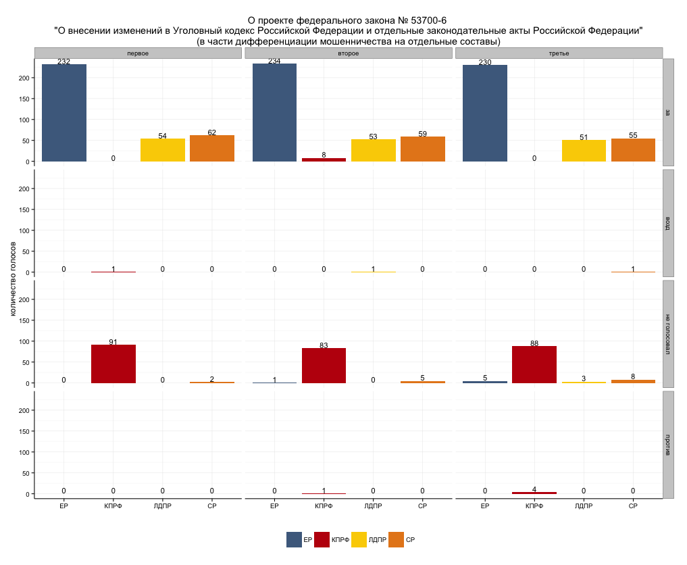

В комментариях меня попросили посмотреть результаты голосований в ГД по отдельному [закону](http://www.rg.ru/2012/12/03/moshennichestvo-dok.html) 207-ФЗ,  внесшему ряд изменений в  УК РФ. Закон действительно любопытный и не громкий (я о нем вообще не слышал до этого)  был быстро принят Госдумой в конце ноября прошлого года и подписан президентом в начале декабря.  
Закон дополнил состав ст. 159 УК РФ ("мошенничество")  шестью отдельными подпунктами:  

  1. Мошенничество в сфере кредитования 
  2. Мошенничество при получении выплат  
  3. Мошенничество с использованием платежных карт 
  4. Мошенничество в сфере предпринимательской деятельности 
  5. Мошенничество в сфере страхования
  6. Мошенничество в сфере компьютерной информации

а также дополнил ст. 303 УК РФ ("Фальсификация доказательств и результатов оперативно-розыскной деятельности"). 

Насколько я понял, одновременно произошло ужесточение наказания по всем подпунктам ст. 159 УК в части увеличения штрафов и сроков наказания. 

Законопроект №53700-6, который привел к 207-ФЗ, был изначально внесен Верховным Судом РФ в апреле прошлого года. В ГД по этому законопроекту состоялось три чтения: первое - 23.10.2012, второе и третье чтение - прошли вместе, ровно через месяц -  23.11.2012.  
  

Вот результаты голосования  в трех чтениях по этому законопроекту: 

  

Как видно, все партии, за исключением КПРФ, последовательно поддерживали законопроект. КПРФ почему-то просто не голосовала практически полным составом, но и  не голосовала "против".
