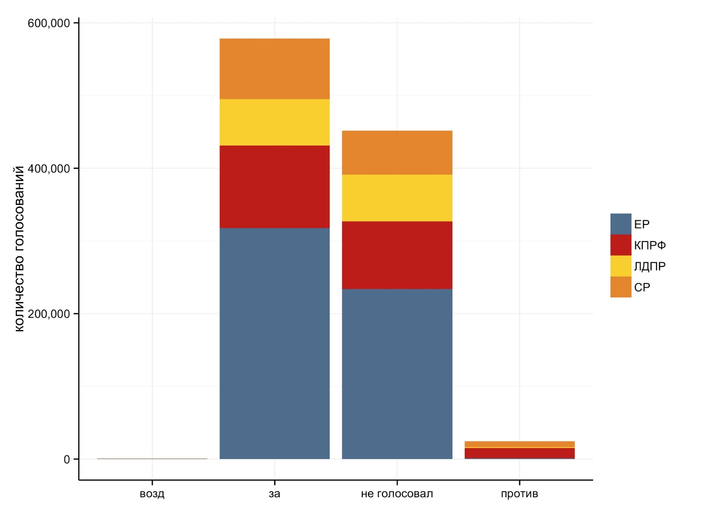
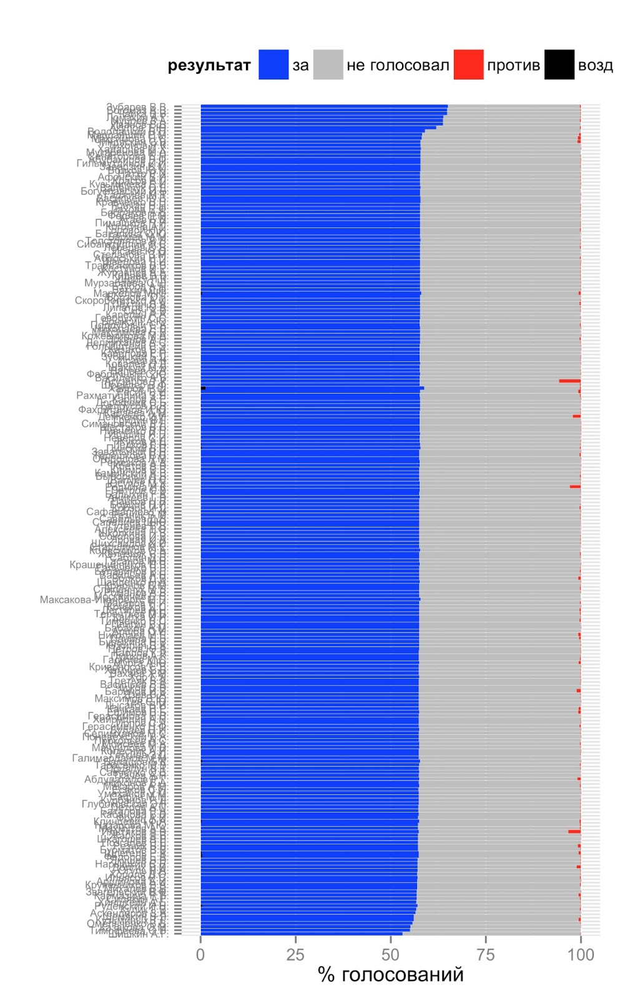
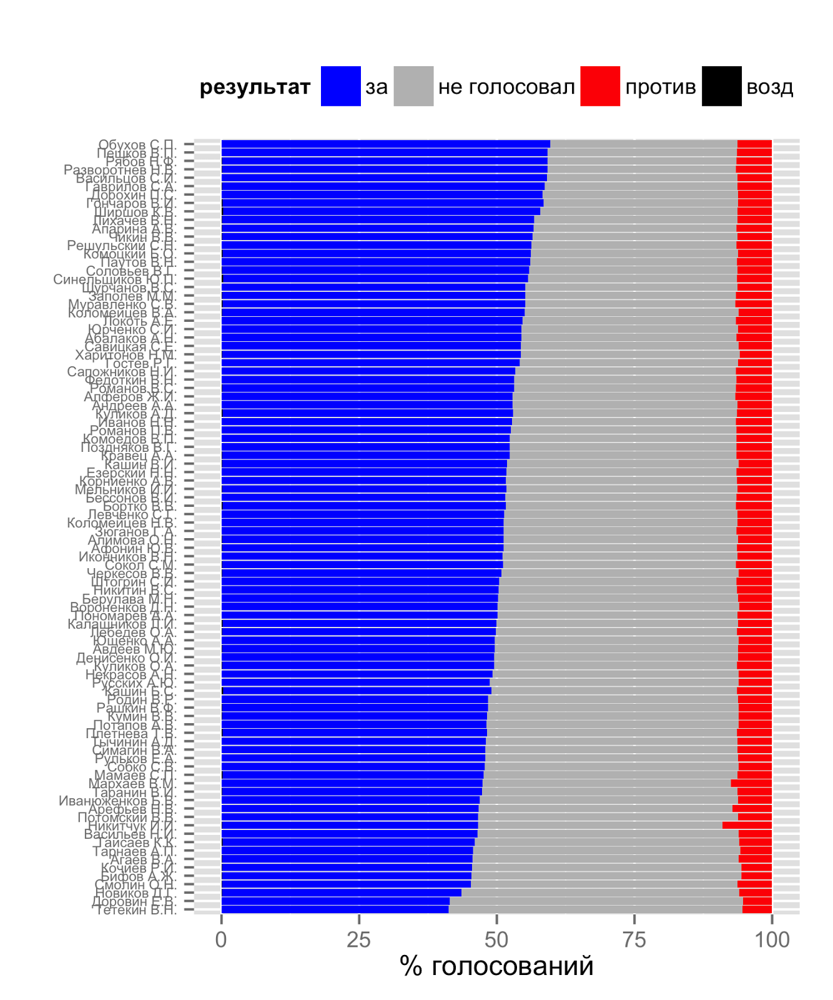
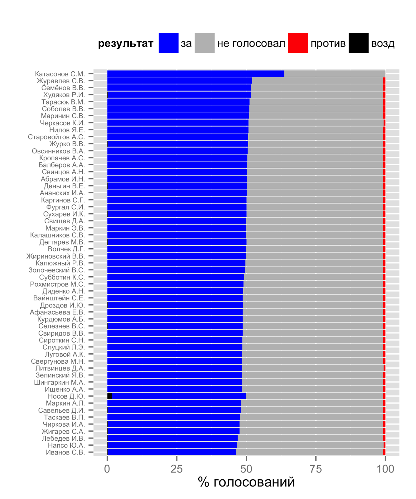
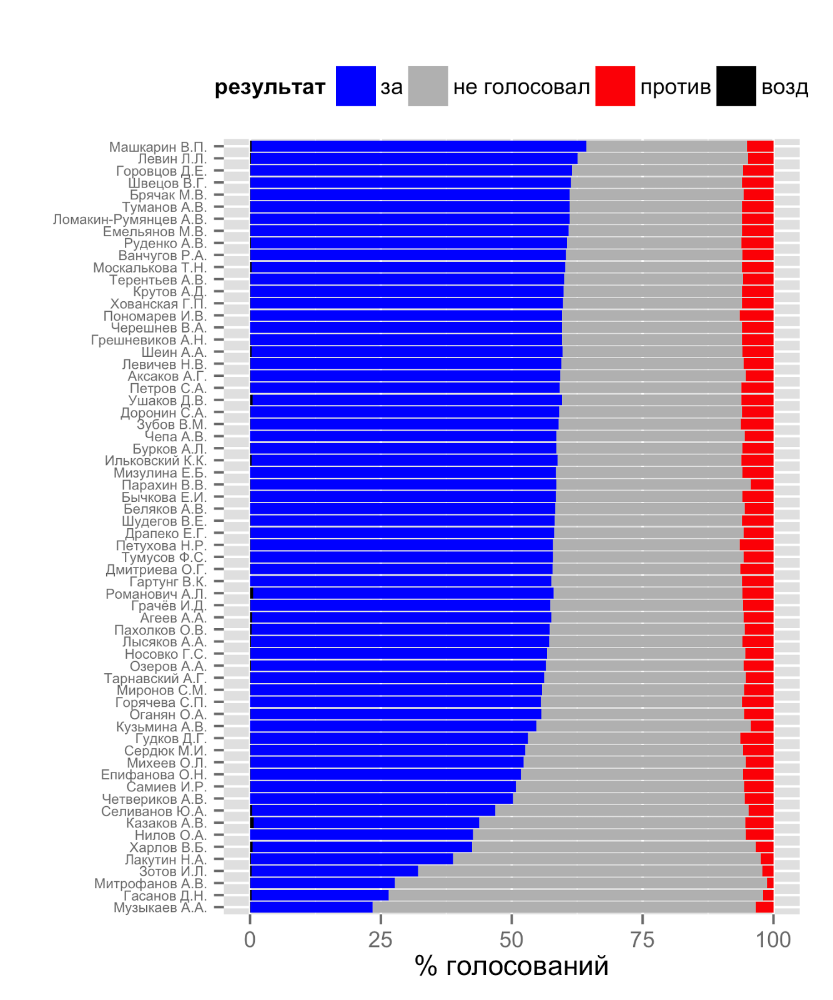
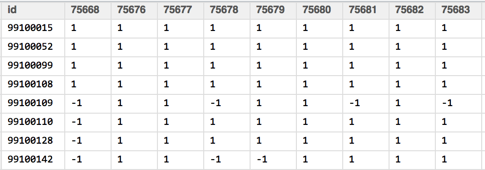
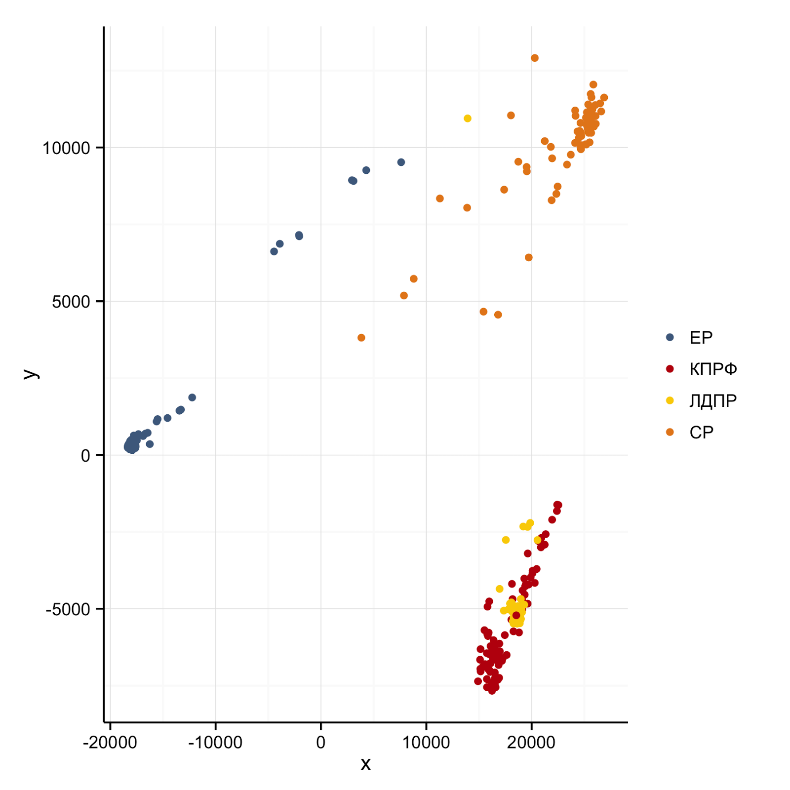
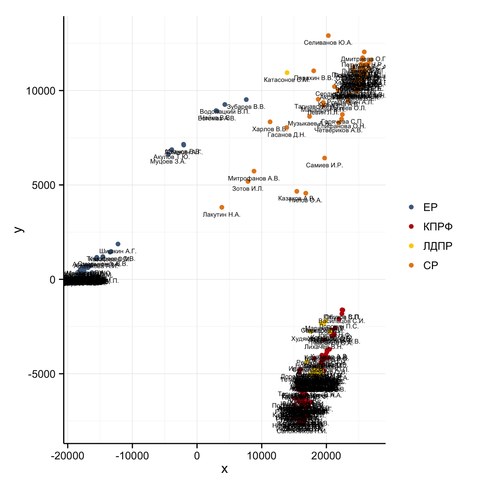

Начало - [здесь](http://quantviews.blogspot.ru/2013/02/2012.html)  
В прошлый раз мы посмотрели на результаты работы ГД с точки зрения законопроектов - сколько их было, какие по ним итоговые результаты голосования и так далее. Теперь пришло время для более серьезного анализа.  
  
Сначала необходимо было получить данные. Я собрал по-депутатные результаты голосования голосования по тем 888 законопроектам, которые обсуждались раньше, с помощью АИС Законопроект и [набора](https://github.com/quantviews/Duma/blob/master/DumaFunctions.R) заранее написанных скриптов.  
По этим законопроектам в прошлом году 2389 голосования в ГД. Таким образом, наш исходный набор данных должен иметь  следующую размерность 2389 голосований * 450 депутатов = 1 075 050, то есть свыше 1 млн точек. Фактически их оказалось несколько меньше. Как я понял, это связано с тем, что из-за ротации депутатов по тем или иным причинам (смерть, отказ от мандата и проч) реальное количество голосующих депутатов не всегда равно 450.  
  
_Я[выложил](https://drive.google.com/folderview?id=0BwmSbblXaJ73OURJczJFMlBtWE0&usp=sharing) все используемые данные в Google Drive для желающих позаниматься собственным анализом. Там же есть и описание формата всех строк. Внимание -  итоговый файл с результатами голосования по отдельным депутатам занимает более 50 мегабайт. _  
  
Теперь посмотрим на сами данные. Вот, к примеру, агрегированная сумма голосов в зависимости от результата. Как видно, чаще всего депутаты голосовали "за", либо вообще не голосовали. Количество голосований "против" не превышает 25 тыс. (то есть менее 2,5% от общего количества поданных). Воздерживаться в Думе вообще не принято - таких голосов за прошый год нашлось только 712 (менее 0,01%).  
Этот график не учитывает то, что количество депутатов от разных партий сильно отличается, поэтому разбивка по партиям дана просто в иллюстративных целях.  
**  График. Количество голосований Государственной Думы в 2012 году **  




Конечно, же можно смотреть и на отдельных депутатов - так как депутатов много, то подобные результаты сложно визуализировать на одном графике. Если разбить их по партиям получается следующая картина (на графиках приведено процентное соотношение результатов 2389 голосований, которые мы анализируем).  
  
**Единая Россия**  




На графике хорошо видна высокая степень единодушия-единороссов. "За" они, похоже, голосуют крайне дисциплинированным образом. Голосовать против не принято - для крупнейшей фракции проще согласованно не голосовать и таким образом срывать кворум.  
  
**КПРФ**  




Среди коммунистов есть заметный разброс по голосам "за", также хорошо заметно, что иногда (в 5% случаях примерно) коммунисты голосую "против".  
  
**ЛДПР**  




ЛДПР, как ожидалось, похожа ЕР. Разброс по голосам "за" между депутатами небольшой, так же не принято голосовать "против".  
  
**Справедливая Россия  **  




Среди справедливороссов наиболее выражен разброс между теми, как разные депутаты голосуют - как по голосам "за", так и по голосам "против". Ряд депутатов в самом низу графика (Митрофанов, Гасанов, Музыкаев) почему-то не голосовали почти в 75% голосований.  
  
Все это конечно интересно - я построил и другие иллюстративные графики, когда разбирался с собранным массивом, но может быть подвержено серьезной критике. К примеру, графики, которые я привел выше - с большими недостатками. К примеру, они не учитывают то, что один депутат может проголосовать "за" в 50% случаях и другой депутат также проголосует "за" в 50% случаях, но это будут как раз другие 50%. И так далее.  
  
Для того, чтобы постараться как-то "обозреть" имеющиеся данные я использовал традиционную статистическую технику, которая использует для подобных целей - [mulidimensional scaling (MDS)](http://en.wikipedia.org/wiki/Multidimensional_scaling). Я не буду описывать ее суть - в сети и в учебниках есть куча отличных описаний. Вкратце ее смысл сводится к набору техник для того, чтобы визуализировать различия в сложных наборах данных.  
В нашем случае мы хотим визуализировать насколько отличаются голосования разных депутатов друг от друга. Сначала мы трансформируем качественные отметки ("за", "против", "воздержался", "не голосовал"). Я пробовал разные варианты, в данном случае использует такой вариант:  
  


  * "за" = 1 
  * "возд" = 0
  * "не голосовал" = -1 
  * "против"  = -1 

  
Мне показалось, что так более адекватно описать данные. Голосования "против" очень редко используется в Думе для выражения своего мнения, гораздо чаще депутаты просто не голосуют в знак своего протеста. К такому же выводу я пришел, когда смотрел на результаты по отдельным  "громким" законопроектам.  
После преобразованная данных получаем матрицу "депутат-законопроект", которая имеет примерно такой вот вид:  




  
Здесь по строкам, которые начинаются с 99.. находятся депутаты, а по строкам отдельные голосования. То есть первый элемент этой матрица говорит о том, что депутат под номером 99100015 (по vote.duma.gov.ru легко посмотреть, что это Апарина Алевтина Викторовна из КПРФ) проголосовала "за" по голосованию №75668. Вот ссылка на само [голосование](http://vote.duma.gov.ru/vote/75668) (как видно, номер голосования соответствует url), депутат Апарина действительно поддержала этот законопроект.  
После этого мы рассчитываем матрицу расстояний между совокупными голосованиями разных с помощью функции dist() в R. А с помощью функции cmdscale() осуществляем классический MDS на матрице расстояний.  
Что же мы получили в итоге. Вот результат визуального представления полученных результатов, сгруппированных по партиям:  
  
**Результат MDS-кластеризации голосований в Государственной думе РФ в 2012 году**  




  


  


 Во первых, сразу хочу отметить, что числа по оси Х и Y не имеют смыслового значения - они зависят от набора данных и используемой кодификации. Во вторых, расстояния между точками - тоже определенный артефакт и их нельзя содержательно интерпретировать. На графике важно выделять кластеры - совокупности точек, которые находятся рядом. Именно по ним можно сказать, что эти точки (то есть депутаты) голосовали схожим образом.  
  
На графике хорошо видно, что слева выделяется ярко выраженный кластер Единой России. Несмотря на то, что единороссов в ГД более всего, они почти все сгруппированы в одну большую точку. Это означает, что почти всегда они голосуют полностью одинаково, никаких различий между отдельными депутатами нет. Несколько отделившихся точек - это в первую очередь депутаты, которые по тем или иными причинам находятся в 6 Думе не с самого начала работы. Поэтому результаты по ним отличаются от других депутатов. К таким относятся депутаты Муцоев, Водолацкий, Зубарев.  
  
На самом верху ярка выражена  Справедливая Россия. Причем депутаты фракции не образуют единый кластер, между ними есть большие различия в голосования. Фактически можно выделить отдельный отдельный кластер и несколько депутатов-еретиков.  
  
Я не ожидал подобных результатов, но депутаты из ЛДПР и КПРФ образуют единый кластер, причем достаточно единообразный. У меня нет содержательных интерпретаций этого результата - буду рад услышать любые предположения. Видимо, его еще нужно проверить на других методах кластерного анализа. Странная желтая (то есть ЛДПР) точка наверху -   это тоже статистический артефакт в виде депутата Катасонова, который появился в Думе только в конце 2012 года.  
Тот же график только с фамилиями - на кластерах они сливаются, но по выделяющимся точкам легко определить фамилию:  




  
Вот исходный код для MDS-кластеризации:  
  

  
  
```r
# Многомерное шкалирование для анализа результатов голосования в ГД РФ за 2012 года
require(reshape2)
require(ggplot2)
# Функция, траснформирующая количественные коды голосования в факторы
SimplifyVotes <- function(result){
  res.q <- vector(length = length(result))
  res.q <- ifelse(result == 'за', 1, res.q)
  res.q <- ifelse(result == 'возд', 0, res.q)
  res.q <- ifelse(result == 'не голосовал', -1, res.q)
  res.q <- ifelse(result == 'против', -1, res.q)
  return(res.q)
}

#загрузить данные
all.votes <- read.csv(file='data4export/votes2012.csv')
laws.2012 <- read.csv(file='data4export/laws2012.csv')
depDuma <- read.csv(file = 'data/DeputatDuma.csv', stringsAsFactors = FALSE)

all.votes$res.q <- SimplifyVotes(all.votes$result)
v.unique <- unique.data.frame(all.votes) #почему то есть повторения в исходных данных - убираем их

rollcall <- dcast(data = v.unique, [c('id', 'url','res.q')], id ~ url, fun.aggregate= sum)
row.names(rollcall) <- rollcall$id #присвоить названия столбцам
rollcall <- rollcall[, -1] #убрать из матрицы коды депутатов
rollcall <- as.matrix(rollcall)

rollcall.dist <- dist(rollcall %*% t(rollcall)) #рассчитать матрицу расстояний
rollcall.mds <- as.data.frame(cmdscale(rollcall.dist,k=2)) # провести кластеризацию

names(rollcall.mds) <- c('x', 'y')
rollcall.mds$id <- row.names(rollcall)
sname <- strsplit(as.character(depDuma$name), ' ') # добавить к матрице фамилии депутатов
depDuma$sname <- sapply(sname, function(x){ paste0(x[[1]], ' ', substr(x[[2]],1,1),'.', substr(x[[3]],1,1),'.')})
rollcall.mds <- merge(rollcall.mds, depDuma, by = 'id')
# построить график с помощью ggplot2

p <- ggplot(data = subset(rollcall.mds), aes(x=x, y=y, group = party))+scale_size(range=c(2,2))
p+geom_jitter(aes(color = party))+ief.theme+
  scale_colour_manual(name = '', values = c('ЕР' = '#4d6b8d', 'КПРФ' = '#bf0d0d',
                                            'ЛДПР' = '#fad000', 'СР' = '#e6871d' ))+
```
  

  
  
  
Полные коды доступны в [репозитарии](https://github.com/quantviews/Duma) на  github - правда в черновом пока виде.
