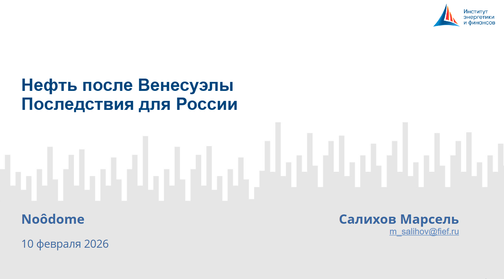

Конференции, отраслевые форумы, академические семинары и публичные панели.

::: {.qv-presentation-grid}

::: {.qv-presentation-card}

{.qv-presentation-cover}

::: {.qv-presentation-body}
### Нефть после Венесуэлы: последствия для России

::: {.qv-presentation-meta}
10 февраля 2026 · Публичная лекция · Noodome (ИЭФ)
:::

::: {.qv-presentation-desc}
Последствия венесуэльского кризиса для российских нефтяных рынков и экспортной политики.
:::

::: {.qv-presentation-links}
[PDF](/assets/publications/2026-02-10-neft-posle-venezuely.pdf) · [Конспект](talks/2026-02-10-neft-posle-venezuely.qmd) · [ИЭФ](https://fief.ru/media/presentations/neft-posle-venesuely-posledstviya-dlya-rossii/)
:::
:::
:::

:::
